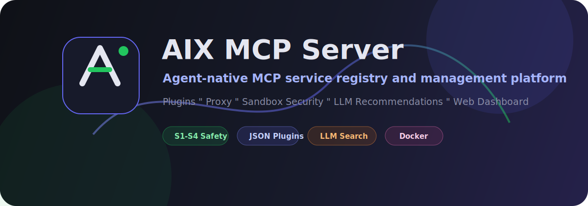
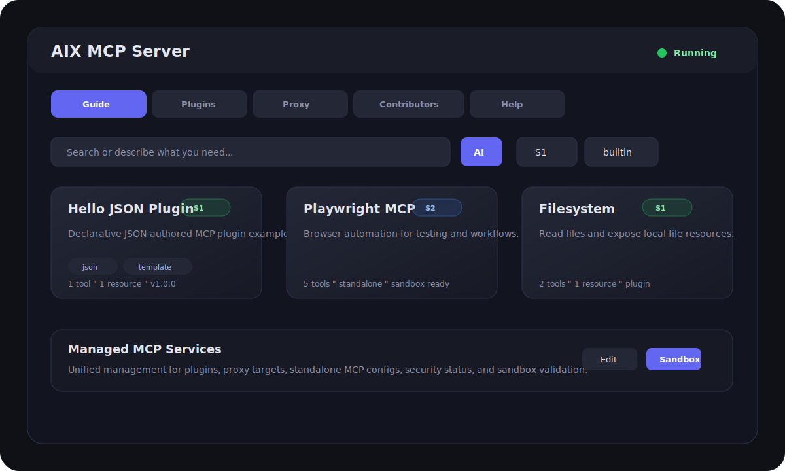
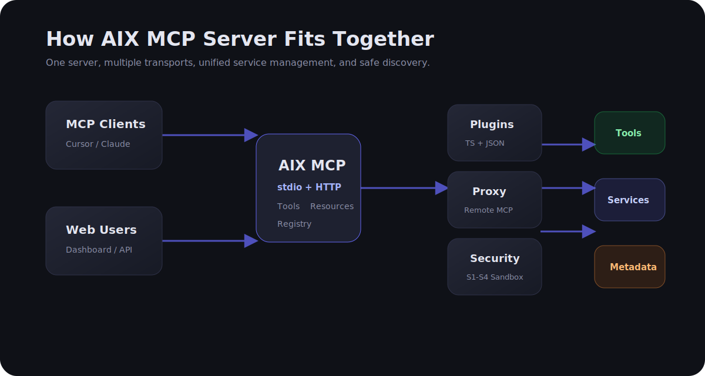

# AIX MCP Server

[English](./README.md)

可扩展的 Model Context Protocol (MCP) 服务器，支持插件系统、代理转发、Web Dashboard 和服务注册中心。



## 特性

- **双传输模式** — stdio（用于 Cursor / Claude Desktop）和 Streamable HTTP
- **插件系统** — 内置 7 个实用插件，支持通过 npm 包、本地路径或 JSON 文件扩展
- **代理转发** — 将多个远程 MCP 服务器聚合为一个统一端点
- **Web Dashboard** — 可视化管理插件、代理、查看日志
- **服务注册中心** — 预置常见 MCP 服务信息，支持一键安装和配置复制
- **LLM 智能搜索** — AI 驱动的 MCP 服务发现与推荐
- **Docker 部署** — 多阶段构建，开箱即用

## 页面预览



## 快速开始

### 本地运行

```bash
npm install
npm run build

# stdio 模式（供 MCP 客户端连接）
npm start

# HTTP 模式（启动 Web 服务 + Dashboard）
node dist/index.js http
```

### Docker 部署

```bash
# 一键构建并启动（后台）
docker compose up --build -d

# 查看日志
docker compose logs -f

# 停止
docker compose down
```

服务默认监听 `http://localhost:3080`。

## 内置插件

| 插件 | Tools | 说明 |
| ------ | ------- | ------ |
| **calculator** | `calculator` | 数学表达式求值 |
| **crypto** | `hash-text`, `random-uuid`, `random-string` | 哈希、UUID、随机字符串 |
| **datetime** | `current-time`, `format-time` | 当前时间、时间格式化 |
| **filesystem** | `list-files`, `read-file` + Resource | 文件列表、读取、文件资源 |
| **hello-json** | `hello-json` + Resource | 声明式 JSON 插件示例 |
| **system** | `run-command` + Resource | Shell 命令执行、系统信息资源 |
| **text-utils** | `json-format`, `base64`, `text-stats` | JSON 格式化、Base64 编解码、文本统计 |

## MCP 客户端配置

### Cursor

在 Cursor 的 MCP 设置中添加：

```json
{
  "mcpServers": {
    "aix-mcp-server": {
      "command": "node",
      "args": ["/path/to/aix-mcp-server/dist/index.js"]
    }
  }
}
```

或使用 HTTP 模式（先启动服务）：

```json
{
  "mcpServers": {
    "aix-mcp-server": {
      "url": "http://localhost:3080/mcp"
    }
  }
}
```

### Claude Desktop

在 `claude_desktop_config.json` 中添加：

```json
{
  "mcpServers": {
    "aix-mcp-server": {
      "command": "node",
      "args": ["/path/to/aix-mcp-server/dist/index.js"]
    }
  }
}
```

## 插件开发

创建一个 TypeScript 文件，导出符合 `McpPlugin` 接口的默认对象：

```typescript
import { z } from "zod";
import type { McpPlugin } from "aix-mcp-server/plugin";

const plugin: McpPlugin = {
  name: "my-plugin",
  description: "My custom plugin",
  register(server) {
    server.registerTool("my-tool", {
      title: "My Tool",
      description: "Does something useful",
      inputSchema: z.object({
        input: z.string().describe("Input value"),
      }),
    }, async ({ input }) => {
      return { content: [{ type: "text", text: `Result: ${input}` }] };
    });
  },
};

export default plugin;
```

参考 `examples/mcp-plugin-example/` 目录获取完整示例。

### JSON 插件

你也可以只用 JSON 创建轻量本地 MCP 插件，类似分享一个油猴脚本。JSON 插件是声明式的，不会执行任意 JavaScript；当前支持模板/json 工具响应和静态资源。

创建 `plugins/my-json-plugin.json`：

```json
{
  "schemaVersion": 1,
  "name": "my-json-plugin",
  "description": "A declarative JSON MCP plugin",
  "tools": [
    {
      "name": "hello",
      "title": "Hello",
      "description": "Return a greeting",
      "inputSchema": {
        "type": "object",
        "required": ["name"],
        "properties": {
          "name": { "type": "string", "description": "Name to greet" }
        }
      },
      "response": {
        "type": "template",
        "text": "Hello {{name}}!"
      }
    }
  ]
}
```

然后添加到 `mcp-plugins.json`：

```json
{
  "source": "./plugins/my-json-plugin.json",
  "enabled": true
}
```

### 安装插件

```bash
# 通过 CLI
node dist/cli.js add ./path/to/plugin
node dist/cli.js add some-npm-package

# 或直接编辑 mcp-plugins.json
```

## 代理配置

编辑 `mcp-proxy.json` 添加远程 MCP 服务器：

```json
{
  "targets": [
    {
      "name": "remote-server",
      "url": "http://other-mcp:3000/mcp",
      "enabled": true,
      "description": "Remote MCP server"
    }
  ]
}
```

## 质量检查

```bash
npm test
npm run registry:validate
```

`registry:validate` 会在提交 PR 前检查 `mcp-registry.json` 和已配置的 JSON 插件。

## 架构概览



贡献者可以阅读 [架构说明](./docs/architecture.md) 和 [Registry 字段规范](./docs/registry-schema.md) 了解模块边界与服务目录格式。

后续版本规划见 [技术路线规划](./docs/roadmap.md)，覆盖 v1.1、v1.2 和 v2.0 的演进方向。

## 故障排查

- `http://localhost:3080/mcp` 返回 `Missing or invalid session ID`：这是浏览器直接打开 MCP 端点时的正常结果。请打开 Dashboard：`http://localhost:3080`，或通过 MCP 客户端连接。
- Dashboard 改动没有出现：修改 TypeScript、插件或配置后，需要重新构建并重启服务或容器。
- JSON 插件加载失败：运行 `npm run registry:validate`，它会返回具体出错字段路径。
- Sandbox 升级失败：在 Dashboard 查看失败检查项和 `Fix` 提示，修复后重新运行 sandbox。

## 项目结构

```text
aix-mcp-server/
├── src/
│   ├── index.ts          # 入口（stdio / HTTP 传输）
│   ├── cli.ts            # 插件管理 CLI
│   ├── loader.ts         # 插件加载器
│   ├── plugin.ts         # 插件接口定义
│   ├── proxy.ts          # 代理转发
│   ├── registry.ts       # 服务注册中心
│   ├── llm.ts            # LLM 提供商集成
│   ├── plugins/          # 内置插件
│   │   ├── calculator.ts
│   │   ├── crypto.ts
│   │   ├── datetime.ts
│   │   ├── filesystem.ts
│   │   ├── system.ts
│   │   └── text-utils.ts
│   └── web/
│       ├── api.ts        # Dashboard API 路由
│       └── dashboard.html
├── mcp-plugins.json      # 插件配置
├── mcp-proxy.json        # 代理配置
├── mcp-registry.json     # 服务注册中心数据
├── llm-config.json       # LLM 提供商配置
├── docker-compose.yml
├── Dockerfile
└── package.json
```

## License

MIT
