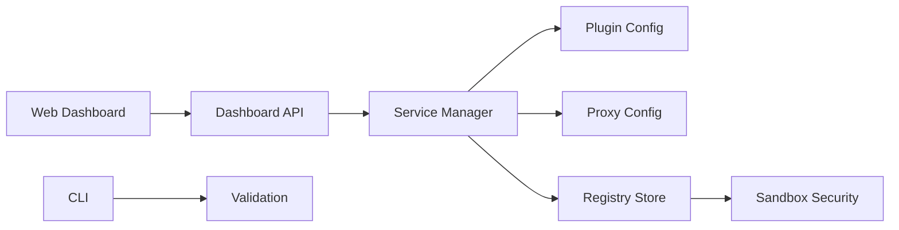

# Architecture Notes / 架构说明

AIX MCP Server is evolving from a local MCP utility into a public, extensible MCP control surface. The current boundary is intentionally simple:

- `src/index.ts`: transport entry point for stdio and HTTP.
- `src/loader.ts`: loads TypeScript, npm, and JSON-authored plugins.
- `src/service-manager.ts`: builds the unified managed service view for plugins, proxy targets, and standalone registry entries.
- `src/registry.ts`: reads and writes the MCP service catalog.
- `src/security.ts`: evaluates sandbox checks and trust-level promotion.
- `src/validation.ts`: validates registry and JSON plugin metadata for local checks and CI.
- `src/web/api.ts`: HTTP API wiring for the dashboard.
- `src/web/dashboard.html`: dashboard UI.

## Desired Direction / 演进方向

## Rules for New Work / 新功能边界规则

- Keep persistence details out of UI code.
- Keep service identity and unified service shape in `service-manager.ts`.
- Keep registry data checks in `validation.ts`.
- Keep security promotion checks in `security.ts`.
- Avoid adding unrelated business logic to `src/web/api.ts`; prefer extracting modules first.

These boundaries keep the current JSON-file implementation simple while leaving room for SQLite, remote registry sync, and multi-user permissions in a later major version.
