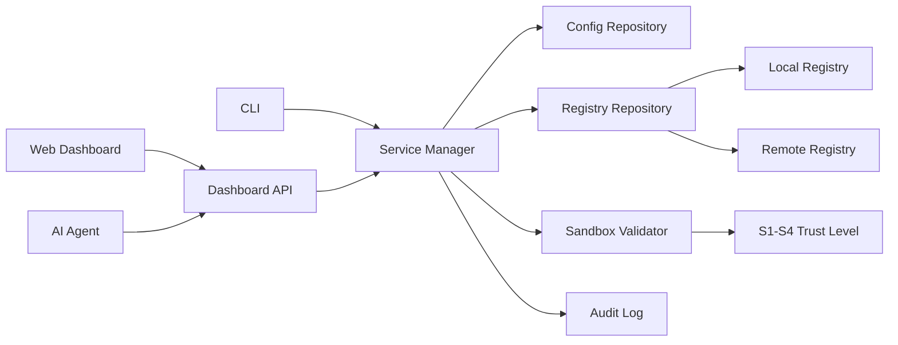

# AIX MCP Server Technical Roadmap / 技术路线规划

AIX MCP Server is evolving from a local MCP utility into a public, extensible MCP service discovery and management platform.

AIX MCP Server 将从本地 MCP 工具逐步演进为面向公开开源生态的 MCP 服务发现、管理与验证平台。

## Product Direction / 产品方向

The roadmap follows a balanced release path:

- `v1.1`: stabilize the current product and make it safe to recommend publicly.
- `v1.2`: improve contribution workflows and registry trust.
- `v2.0`: prepare the platform architecture for remote registries, permissions, and multi-environment management.

路线采用平衡节奏：

- `v1.1`：稳定当前能力，让公开用户可以放心安装和使用。
- `v1.2`：增强贡献流程和注册中心可信度。
- `v2.0`：为远程注册源、权限、多环境管理等平台化能力做架构准备。

## Current Foundation / 当前基础

The project already includes:

- MCP stdio and Streamable HTTP transports
- Built-in TypeScript plugins
- Declarative JSON plugins
- MCP proxy forwarding
- Web Dashboard
- Guide Center service registry
- LLM-powered service recommendations
- S1-S4 security levels and sandbox validation
- Markdown-backed Help Center
- Docker and GitHub Actions support

## v1.1 Stable Release / v1.1 稳定增强版

Goal: make the current product reliable, understandable, and easy to troubleshoot for public users.

目标：让现有产品对公开用户足够稳定、易理解、易排查。

### v1.1 Scope / v1.1 范围

- Improve Dashboard feedback for add, edit, delete, test, install, copy, and sandbox actions.
- Standardize API error responses so frontend and agents can handle failures consistently.
- Add actionable sandbox recommendations for failed checks.
- Strengthen JSON plugin validation with field-level error paths.
- Add tests, registry validation, and CI gates.
- Expand README and Help Center troubleshooting content.

### v1.1 Acceptance Criteria / v1.1 验收标准

- A new user can start Docker, open the Dashboard, add an MCP service, and run sandbox validation within 10 minutes.
- Common Dashboard operations show clear success or failure feedback.
- JSON plugin errors identify the exact invalid field path.
- Sandbox failures include a concrete fix recommendation.
- `npm test` and `npm run registry:validate` pass locally and in CI.

## v1.2 Registry & Contribution Release / v1.2 注册中心与贡献生态版

Goal: make it easy for contributors to submit useful MCP services and for maintainers to review them safely.

目标：让贡献者更容易提交 MCP 服务，让维护者更容易审核和建立可信目录。

### v1.2 Scope / v1.2 范围

- Document the registry schema and contribution requirements.
- Extend the pull request template with registry checklist, sandbox result, license confirmation, and screenshots.
- Improve registry validation rules for duplicate ids, source quality, capability declarations, and install safety.
- Add richer service metadata:
  - compatibility: Cursor, Claude Desktop, HTTP clients
  - maintenance status
  - last validated date
  - screenshots or preview assets
  - known limitations
- Improve LLM recommendation prompts, ranking, and fallback behavior.

### v1.2 Acceptance Criteria / v1.2 验收标准

- Contributors can add a registry entry by following documentation only.
- Maintainers can validate registry quality with one command.
- Service cards expose enough metadata for users to decide whether a service is safe and useful.
- LLM recommendations explain why a service was selected.

## v2.0 Platform Architecture / v2.0 平台化架构版

Goal: evolve from a local dashboard into a platform-ready MCP control surface.

目标：从本地 Dashboard 演进为具备平台化能力的 MCP 控制台。

### v2.0 Scope / v2.0 范围

- Introduce repository interfaces for config and registry storage.
- Keep JSON file storage as the default implementation.
- Prepare optional SQLite or remote sync implementations.
- Split local registry, bundled registry, user registry, and remote registry sources.
- Add trust and permission concepts:
  - administrator
  - contributor
  - readonly user
  - agent actor
- Add audit logs for install, edit, sandbox, upgrade, and delete actions.
- Provide agent-native APIs for service discovery, validation, repair suggestions, and contribution workflows.

### Architecture Direction / 架构方向

### v2.0 Acceptance Criteria / v2.0 验收标准

- API handlers no longer own persistence or registry business rules directly.
- Config and registry storage can be replaced without rewriting Dashboard logic.
- Security decisions are auditable.
- Agents can complete core workflows through documented APIs.

## Engineering Principles / 工程原则

- Prefer small, reviewable releases over large rewrites.
- Preserve local-first usage as the default experience.
- Keep JSON-based configuration easy to understand and edit.
- Use validation and sandbox checks to build trust instead of hiding risk.
- Make every user-facing failure actionable.
- Keep agent workflows first-class: if a user can do it in the UI, an agent should be able to do it through APIs.

## Release Checklist / 发布检查清单

Before each release:

- Run `npm test`.
- Run `npm run registry:validate`.
- Verify Docker startup.
- Verify Dashboard add, edit, install, sandbox, and delete flows.
- Review README, Help Center, and screenshots.
- Confirm CI passes on the target branch.

## Near-Term Backlog / 近期待办

- Add screenshots or generated preview images for real Dashboard states.
- Add registry metadata for compatibility and last validation time.
- Add a local audit log API and Dashboard panel.
- Add structured API docs for agent usage.
- Add more JSON plugin examples for common MCP utility patterns.
